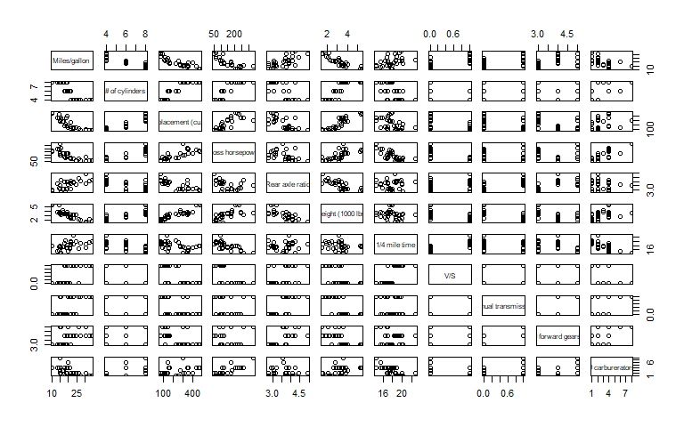
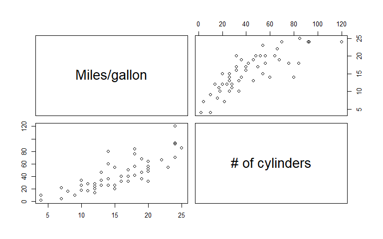

<!-- README.md is generated from README.Rmd. Please edit that file -->

# testmaker

<!-- badges: start -->
<!-- badges: end -->

The goal of `testmaker` is to streamline the generation of parameter
checking and testthat test generation for dataframes, based on template
data frames. When developing R code for packages, it’s valuable to write
test functions using the `testthat` framework. When writing functions
for packages and for other large projects (especially involving multiple
people or functions), it’s also valuable to write small tests to check
that provided inputs are what you intend them to be. I’m involved in
work that has a few dataframes that are used repeatedly in many
functions (either generating them or taking them in as arguments).

This package streamlines writing R code checks the basic characteristics
of a dataframe: dimensions, column names, column types. The central
conceit of this package is that as a developer you have a template
dataframe with the correct characteristics; the functions in this
package identify those characteristics, write appropriate R code to test
for them, and print that code / copy it to your system clipboard for
easy adding to your code.

This package was inspired by a package development workshop put on by
Andy Teucher (<https://andyteucher.ca>) and Sam Albers
(<https://samalbers.science>).

## Installation

You can install the development version of testmaker like so:

``` r
devtools::install_github("cbedwards-dfw/testmaker")
```

## Example

### Writing `testthat` tests

Let’s presume we are writing a function to aggregate data from different
sources, and we know that if the function behaves correctly, it should
result in a dataframe with the same column names and column types as the
dataframe `mtcars`. We can easily generate appropriate code for a
`testthat` test:

``` r
library(testmaker)
testmaker_df_tt(mtcars, return.style = "none")
#> expect_equal(nrow(res), 32)
#> expect_equal(ncol(res), 11)
#> expect_type(res$mpg, "double")
#> expect_type(res$cyl, "double")
#> expect_type(res$disp, "double")
#> expect_type(res$hp, "double")
#> expect_type(res$drat, "double")
#> expect_type(res$wt, "double")
#> expect_type(res$qsec, "double")
#> expect_type(res$vs, "double")
#> expect_type(res$am, "double")
#> expect_type(res$gear, "double")
#> expect_type(res$carb, "double")
#> expect_equal(names(res), c("mpg", "cyl", "disp", "hp", "drat", "wt", "qsec", "vs", "am", "gear", "carb"))
```

Note that I specify `return.style = "none"` here because the default
behavior of saving to the clipboard doesn’t work well in readme files.
When actually using this function (with the default return.style), our
next step would be to paste our clipboard into a `testthat` function, in
which we have already written code to generate an object named `res`
using the function we’re developing.

`testmaker_df_tt` generates all tests that are likely to be relevant,
but we may not want all of them in any given situation. For example, in
`foo` we may not expect our data frame to have the same number of rows
as `mtcars`. The intended use for `testmaker_df_tt` is to call the
function with just the template dataframe, paste into our test function,
and delete any lines that are not appropriate for our scenario (To
streamline deleting unneeded tests, the tests for checking column types
is split into one line per column). The functions of this package are
not intended to replace our decision-making when writing tests, merely
to reduce the typing necessary.

Individual functions for generating code to test for individual
characteristics can be called separately
(e.g. `testmaker_df_names_tt()`), but I generally find it easier to call
the primary function and just delete the generated lines I do not need.

### Checking inputs

Let’s presume we’re writing a function that takes as an input a
dataframe with the same number of columns, same column names, and same
types as `mtcars`. As an example, the following function takes
`mtcars`-like dataframes and makes a paired plot of some selected
columns. Perhaps we and our collaborators/coworkers have dozens of
alternative `mtcars`-like dataframes representing different sets of
cars, and we wrote this function to streamline plot-making.

``` r
foo = function(dat){
  pairs(dat[,-(5:11)],
        labels = c(
          "Miles/gallon",
          "# of cylinders",
          "Displacement (cu.in.)",
          "Gross horsepower"
        ))
}
```

The function `foo` function is quite fragile (intentionally so). If we
feed it data that doesn’t match the columns names (in order) that we’re
expecting, our labels will be wrong; if our input don’t have enough
columns, `foo` will generate a simpler plot with the existing columns.
Let’s compare `foo` behavior when given an appropriate dataframe
(`mtcars`) and an inappropriate dataframe (`cars`).

``` r
foo(mtcars)
```



``` r
foo(cars)
```



The second plot has incorrect labels (the two columns in `cars` are
“Speed (mph)” and “Stopping distance”; see `?cars`) and is not plotting
the type of data we intended to, but we did not get an error. Instead,
the function successfully ran and gave us misleading results. If we want
to make this function more robust, we can use `testmaker_df_sin()` to
generate `stopIfNot()` code check that `dat` has characteristics that
match our template dataframe (`mtcars`). (Yes, in this case we could
also rewrite the existing code to be far less fragile, but that is not
always easy/possible).

``` r
testmaker_df_sin(mtcars, return.style = "none", object.name = "dat")
#> stopifnot("Number of rows in `dat` is not 32" = nrow(dat) == 32)
#> stopifnot("Number of columns in `dat` is not 11" = ncol(dat) == 11)
#> stopifnot("In `dat`, type of column `mpg` is not double" = typeof(dat$mpg) == "double")
#> stopifnot("In `dat`, type of column `cyl` is not double" = typeof(dat$cyl) == "double")
#> stopifnot("In `dat`, type of column `disp` is not double" = typeof(dat$disp) == "double")
#> stopifnot("In `dat`, type of column `hp` is not double" = typeof(dat$hp) == "double")
#> stopifnot("In `dat`, type of column `drat` is not double" = typeof(dat$drat) == "double")
#> stopifnot("In `dat`, type of column `wt` is not double" = typeof(dat$wt) == "double")
#> stopifnot("In `dat`, type of column `qsec` is not double" = typeof(dat$qsec) == "double")
#> stopifnot("In `dat`, type of column `vs` is not double" = typeof(dat$vs) == "double")
#> stopifnot("In `dat`, type of column `am` is not double" = typeof(dat$am) == "double")
#> stopifnot("In `dat`, type of column `gear` is not double" = typeof(dat$gear) == "double")
#> stopifnot("In `dat`, type of column `carb` is not double" = typeof(dat$carb) == "double")
#> stopifnot('`dat` column names do not match expectation.\nShould be: c("mpg", "cyl", "disp", "hp", "drat", "wt", "qsec", "vs", "am", "gear", "carb")' = identical(names(dat), c("mpg", "cyl", "disp", "hp", "drat", "wt", "qsec", "vs", "am", "gear", "carb")))
```

Here we specify the object name (alternatively we could leave
object.name at the default, which is “res”, and then find/replace in the
new text). Pasting our system clipboard into our function definition and
deleting tests we don’t need (row number), we get this an updated, more
robust version of `foo`.

``` r
foo2 = function(dat){
  stopifnot("Number of rows in `dat` is not 32" = nrow(dat) == 32)
  stopifnot("Number of columns in `dat` is not 11" = ncol(dat) == 11)
  stopifnot("In `dat`, type of column `mpg` is not double" = typeof(dat$mpg) == "double")
  stopifnot("In `dat`, type of column `cyl` is not double" = typeof(dat$cyl) == "double")
  stopifnot("In `dat`, type of column `disp` is not double" = typeof(dat$disp) == "double")
  stopifnot("In `dat`, type of column `hp` is not double" = typeof(dat$hp) == "double")
  stopifnot("In `dat`, type of column `drat` is not double" = typeof(dat$drat) == "double")
  stopifnot("In `dat`, type of column `wt` is not double" = typeof(dat$wt) == "double")
  stopifnot("In `dat`, type of column `qsec` is not double" = typeof(dat$qsec) == "double")
  stopifnot("In `dat`, type of column `vs` is not double" = typeof(dat$vs) == "double")
  stopifnot("In `dat`, type of column `am` is not double" = typeof(dat$am) == "double")
  stopifnot("In `dat`, type of column `gear` is not double" = typeof(dat$gear) == "double")
  stopifnot("In `dat`, type of column `carb` is not double" = typeof(dat$carb) == "double")
  stopifnot('`dat` column names do not match expectation.\nShould be: c("mpg", "cyl", "disp", "hp", "drat", "wt", "qsec", "vs", "am", "gear", "carb")' = identical(names(dat), c("mpg", "cyl", "disp", "hp", "drat", "wt", "qsec", "vs", "am", "gear", "carb")))
  
  
  
  pairs(dat[,-(5:11)],
        labels = c(
          "Miles/gallon",
          "# of cylinders",
          "Displacement (cu.in.)",
          "Gross horsepower"
        ))
}
```

Let’s see how this new function behaves when given `mtcars` or `cars`.

``` r
foo2(mtcars)
```


``` r
foo2(cars)
#> Error in foo2(cars): Number of rows in `dat` is not 32
```

Now when we (or another user) accidentally give `foo2` the wrong data
type, we (or they) receive an informative error message rather than
having the function silently behave incorrectly.

In the case of `foo2()`, it may be cleaner to write a single test of
column types, since we know they all need to be type double. The
generated tests from `testmaker` are meant to be a starting point rather
than an ending point.

### Checking column values

In some cases it may be useful to ensure that one or more columns of an
input (or output) contain only the expected values or all of the
expected values. As an example, imagine our template dataframe is an
augmented version of the built-in data `state.x77` that contains a
column `state`. Our hypothetical function should produce a similar
dataframe, including a `state` column which should contain *all* of the
entries from our template dataframe. Let’s first create our template
dataframe (in application, this probably already exists):

``` r
dat = data.frame(state = rownames(state.x77), state.x77)
head(dat)
#>                 state Population Income Illiteracy Life.Exp Murder HS.Grad
#> Alabama       Alabama       3615   3624        2.1    69.05   15.1    41.3
#> Alaska         Alaska        365   6315        1.5    69.31   11.3    66.7
#> Arizona       Arizona       2212   4530        1.8    70.55    7.8    58.1
#> Arkansas     Arkansas       2110   3378        1.9    70.66   10.1    39.9
#> California California      21198   5114        1.1    71.71   10.3    62.6
#> Colorado     Colorado       2541   4884        0.7    72.06    6.8    63.9
#>            Frost   Area
#> Alabama       20  50708
#> Alaska       152 566432
#> Arizona       15 113417
#> Arkansas      65  51945
#> California    20 156361
#> Colorado     166 103766
```

We can generate tests for the presence of expected values and absence of
unexpected values in the `state` column of an object from our
hypothetical function by using the `testmaker_df_colcontents_tt`.

``` r
testmaker_df_colcontent_tt(dat, cols = "state", return.style = "none")
#> ## Recreating expected entries
#> entries.expect = list(state = c("Alabama", "Alaska", "Arizona", "Arkansas", "California", "Colorado", 
#>   "Connecticut", "Delaware", "Florida", "Georgia", "Hawaii", "Idaho", 
#>   "Illinois", "Indiana", "Iowa", "Kansas", "Kentucky", "Louisiana", 
#>   "Maine", "Maryland", "Massachusetts", "Michigan", "Minnesota", 
#>   "Mississippi", "Missouri", "Montana", "Nebraska", "Nevada", "New Hampshire", 
#>   "New Jersey", "New Mexico", "New York", "North Carolina", "North Dakota", 
#>   "Ohio", "Oklahoma", "Oregon", "Pennsylvania", "Rhode Island", 
#>   "South Carolina", "South Dakota", "Tennessee", "Texas", "Utah", 
#>   "Vermont", "Virginia", "Washington", "West Virginia", "Wisconsin", 
#>   "Wyoming"))
#> ## Checking that column(s) contain no unexpected entries
#> expect_true(all(unique(res$state) %in% entries.expect$state))
#> ## Checking that column(s) contain all expected entries
#> expect_true(all(entries.expect$state %in% unique(res$state)))
```

We can specify multiple columns to generate code to check each of them.
Here we add a new column to our template as an example

``` r
dat$category= sample(letters[1:5], size = nrow(dat), replace = TRUE)
head(dat)
#>                 state Population Income Illiteracy Life.Exp Murder HS.Grad
#> Alabama       Alabama       3615   3624        2.1    69.05   15.1    41.3
#> Alaska         Alaska        365   6315        1.5    69.31   11.3    66.7
#> Arizona       Arizona       2212   4530        1.8    70.55    7.8    58.1
#> Arkansas     Arkansas       2110   3378        1.9    70.66   10.1    39.9
#> California California      21198   5114        1.1    71.71   10.3    62.6
#> Colorado     Colorado       2541   4884        0.7    72.06    6.8    63.9
#>            Frost   Area category
#> Alabama       20  50708        d
#> Alaska       152 566432        d
#> Arizona       15 113417        d
#> Arkansas      65  51945        a
#> California    20 156361        a
#> Colorado     166 103766        e
```

``` r
testmaker_df_colcontent_tt(dat, cols = c("state", "category"), return.style = "none")
#> ## Recreating expected entries
#> entries.expect = list(state = c("Alabama", "Alaska", "Arizona", "Arkansas", "California", "Colorado", 
#>   "Connecticut", "Delaware", "Florida", "Georgia", "Hawaii", "Idaho", 
#>   "Illinois", "Indiana", "Iowa", "Kansas", "Kentucky", "Louisiana", 
#>   "Maine", "Maryland", "Massachusetts", "Michigan", "Minnesota", 
#>   "Mississippi", "Missouri", "Montana", "Nebraska", "Nevada", "New Hampshire", 
#>   "New Jersey", "New Mexico", "New York", "North Carolina", "North Dakota", 
#>   "Ohio", "Oklahoma", "Oregon", "Pennsylvania", "Rhode Island", 
#>   "South Carolina", "South Dakota", "Tennessee", "Texas", "Utah", 
#>   "Vermont", "Virginia", "Washington", "West Virginia", "Wisconsin", 
#>   "Wyoming"),
#> category = c("d", "a", "e", "c", "b"))
#> ## Checking that column(s) contain no unexpected entries
#> expect_true(all(unique(res$state) %in% entries.expect$state))
#> expect_true(all(unique(res$category) %in% entries.expect$category))
#> ## Checking that column(s) contain all expected entries
#> expect_true(all(entries.expect$state %in% unique(res$state)))
#> expect_true(all(entries.expect$category %in% unique(res$category)))
```

As a word of warning, this function should only be used on columns that
contain some kind of identifier, not columns with values that do not
fall into discrete classes (e.g., we should avoid using this on the
“Income” or “Population” columns of our example data). This is because
(a) we typically don’t expect the set of measured or calculated values
to be identical between the template and our function’s input or output,
and (b) for larger template dataframes, the generated code could end up
being very large if there are many unique values.

If we expect values of some column to be within a numerical range, that
should be written as a separate test. Because of the the low probability
that the appropriate range is exactly that in a template dataframe,
there is no `testmaker` function to streamline writing this sort of
test.

## Function name conventions

Primary functions are written in the form
`testmaker_df_{output type}()`, where the output type is in abbreviated
form: `tt` refers to `testthat`, `sin` refers to `stopIfNot`, and `cli`
refers to `cli_abort`. Sub functions are written in the form
`testmaker_df_{dataframe characteristic}_{output type}()`. The inclusion
of `_df_` leaves room to develop equivalent functions for other data
types if that becomes useful.

## Dev wishlist

I intend to add the following features:

- `.*_cli()` functions that provide equivalent output to the `.*sin()`
  functions but using `cli::cli_abort()`. This would match the
  conventions used in other FRAM team packages.

## Dev notes

It was suggested this could be provided in the testthat setup files:
<https://testthat.r-lib.org/articles/special-files.html>. From that:

> Helper files live in tests/testtthat/, start with helper, and end with
> .r or .R. They are sourced by devtools::load_all() (so they’re
> available interactively when developing your packages) and by
> test_check() and friends (so that they’re available no matter how your
> tests are executed).

I will dig into how this package can easily be inserted in the the
testthat setup files, and will update documentation with instructions
when I have done so.
