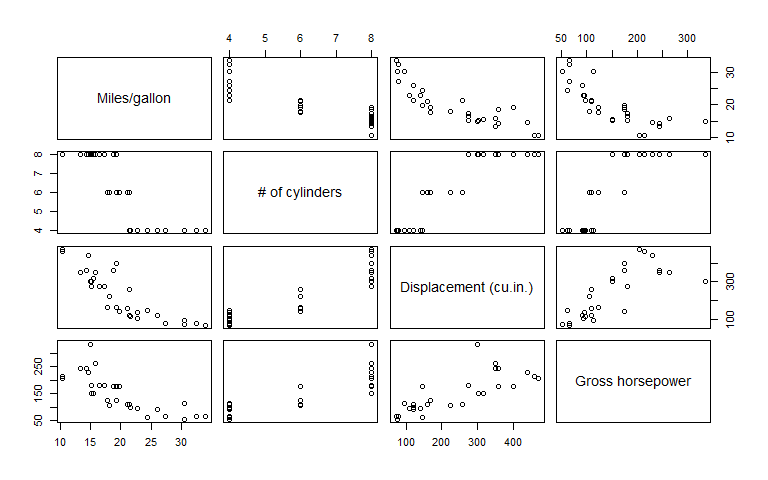
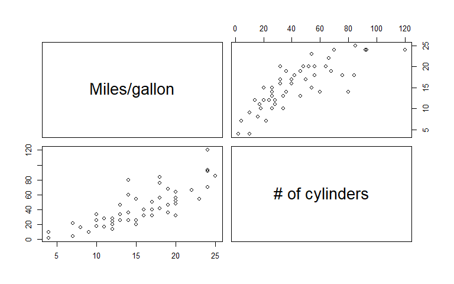
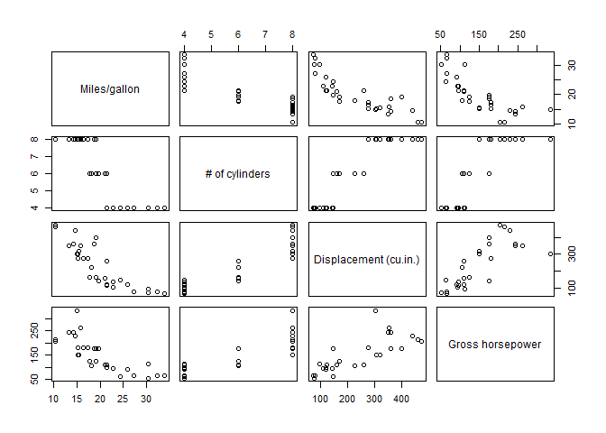

<!-- README.md is generated from README.Rmd. Please edit that file -->

# testmaker

<!-- badges: start -->
<!-- badges: end -->

The goal of `testmaker` is to streamline the generation of parameter
checking and testthat test generation for dataframes, based on template
data frames. When developing R code for packages, it’s valuable to write
test functions using the `testthat` framework. When writing functions
for packages and for other large projects (especially involving multiple
people or functions), it’s also valuable to write small tests to check
that arguments inputs are what you intend them to be. In many cases
these tests are small, but when arguments or outputs can be dataframes
that should have specific configurations of columns, column names, and
column types, writing tests can become tedious.

This package streamlines that process by using a template dataframe with
the appropriate charactereristics (e.g., the input dataframe you are
using when developing your code), and generates testthat code or input
checks to compare the output or input characteristics against those
obtained from the template. Notably, by generating R code for these
tests, this workflow does not require that the template dataframe be
available to the user at runtime, and allows easy moidfication of the
tests to rmove individual criterion.

This package was inspired by a package development workshop put on by
Andy Teucher (<https://andyteucher.ca>) and Sam Albers
(<https://samalbers.science>).

## Installation

You can install the development version of testmaker like so:

``` r
devtools::install_github("cbedwards-dfw/testmaker")
```

## Example

### Quick demonstration

The functions in `testmaker` generate useful R code based on the
characteristic of a template dataframe. Before we get into the
specifics, a brief demonstration of using `testmaker` to write a helper
function to test a dataframe input, based on the characteristics of the
`cars` dataframe:

``` r
library(testmaker)
testmaker_df_validator(cars, return.style = "none")
#>  <- function(x, arg = rlang::caller_arg(x), call = rlang::caller_env()){
#> ## Checking if x is a dataframe ------
#> if(!is.data.frame(x)){
#>   abort.val = class(x)
#> cli::cli_abort("`{arg}` must be dataframe, but is {abort.val}.", call = call)
#> }
#> ## Checking if x has correct dimensions ------
#> if(nrow(x) != 50){
#>   abort.val = nrow(x)
#> cli::cli_abort("Number of rows in `{arg}` must be 50, but is {abort.val}.", call = call)
#> }
#> if(ncol(x) != 2){
#>   abort.val = ncol(x)
#> cli::cli_abort("Number of columns in `{arg}` must be 2, but is {abort.val}.", call = call)
#> }
#> ## Checking if x exactly matches expected column names ------
#> names.expected = c("speed", "dist")
#> names.surprising = names(x)[! names(x) %in% names.expected]
#> names.missing = names.expected[! names.expected %in% names(x)]
#> names.expected.dup = names.expected[duplicated(names.expected)]
#> names.provided.dup = names(x)[duplicated(names(x))]
#> text.use = c("One or more column names in `{arg}` does not match expectations.",
#> "Missing column(s): {ifelse(length(names.missing) == 0, \"[none]\", paste0(names.missing, collapse = \", \"))}.",
#> "Unexpected column(s): {ifelse(length(names.surprising) == 0, \"[none]\",paste0(names.surprising, collapse = \", \"))}")
#> if(length(c(names.expected.dup, names.provided.dup)) != 0){
#> text.use = c(text.use,"!" = "Warning: there is some column name duplication.",
#> paste0("Expected duplicate names: ",
#> ifelse(length(names.expected.dup) == 0,
#> "[none]",
#> paste0(names.expected.dup, collapse = ", ")), "."),
#> paste0("Observed duplicate names: ",
#> ifelse(length(names.provided.dup) == 0, "[none]", paste0(names.provided.dup, collapse = ", ")), "."
#> )
#> )
#> }
#> if(!identical(names(x), c("speed", "dist"))){
#> cli::cli_abort(text.use, call = call)
#> }
#> ## Checking if x has the correct column classes ------
#> test.df = rbind( ## if individual column classes don't matter, delete their entries below
#>   data.frame(name = "speed", correct = "numeric", cur = class(x$speed)),
#>   data.frame(name = "dist", correct = "numeric", cur = class(x$dist))
#> )
#> test.vec = test.df$correct != test.df$cur
#> if(any(test.vec)){
#>   cli::cli_abort(c("`{arg}` must have appropriate column classes.",
#> glue::glue('Column `{test.df$name[test.vec]}` must be of class "{test.df$correct[test.vec]}" but is class "{test.df$cur[test.vec]}".')), call = call
#> )
#> }
#> }
```

### Writing `testthat` tests

Let’s presume we are writing a function to aggregate data from different
sources, and we know that if the function behaves correctly, it should
result in a dataframe with the same column names and column types as the
dataframe `mtcars`. We can easily generate appropriate code for a
`testthat` test with `testmaker_df_tt()`.

``` r
testmaker_df_tt(mtcars, return.style = "none")
#> expect_equal(nrow(res), 32)
#> expect_equal(ncol(res), 11)
#> expect_equal(class(res$mpg), "numeric")
#> expect_equal(class(res$cyl), "numeric")
#> expect_equal(class(res$disp), "numeric")
#> expect_equal(class(res$hp), "numeric")
#> expect_equal(class(res$drat), "numeric")
#> expect_equal(class(res$wt), "numeric")
#> expect_equal(class(res$qsec), "numeric")
#> expect_equal(class(res$vs), "numeric")
#> expect_equal(class(res$am), "numeric")
#> expect_equal(class(res$gear), "numeric")
#> expect_equal(class(res$carb), "numeric")
#> expect_equal(names(res), c("mpg", "cyl", "disp", "hp", "drat", "wt", "qsec", "vs", "am", "gear", "carb"))
```

Note that the code above specifies `return.style = "none"` because the
default behavior (saving to the clipboard) doesn’t work correctly when
building readme files readme files. When actually using this function,
we would instead call `testmaker_df_tt(mtcars)`, and our next step would
be to paste our clipboard into a `testthat` function, in which we have
already written code to generate an object named `res` using the
function we’re developing. As an example, our `testthat` code might look
like

``` r
test_that("Function `my_fun` produces appropriate data frame output",{
res = my_fun()
## the rest of this code was generated with testmaker_df_tt(mtcars)
expect_equal(nrow(res), 32)
expect_equal(ncol(res), 11)
expect_equal(class(res$mpg), "numeric")
expect_equal(class(res$cyl), "numeric")
expect_equal(class(res$disp), "numeric")
expect_equal(class(res$hp), "numeric")
expect_equal(class(res$drat), "numeric")
expect_equal(class(res$wt), "numeric")
expect_equal(class(res$qsec), "numeric")
expect_equal(class(res$vs), "numeric")
expect_equal(class(res$am), "numeric")
expect_equal(class(res$gear), "numeric")
expect_equal(class(res$carb), "numeric")
expect_equal(names(res), c("mpg", "cyl", "disp", "hp", "drat", "wt", "qsec", "vs", "am", "gear", "carb"))
})
```

`testmaker_df_tt` generates all tests that are likely to be relevant,
but we may not want all of them in any given situation. For example, we
might not expect `my_fun` to always produce a dataframe with exactly 32
rows, in which case we should delete that line from the test. (To
streamline deleting unwanted tests, the tests for checking column types
is split into one line per column). The functions of the `testmaker`
package are not intended to replace decision-making when writing tests,
merely to reduce the typing necessary.

Individual functions for generating `testthat` code to test for
individual characteristics can be called separately
(e.g. `testmaker_df_names_tt()` generates just the tests comparing
names), but it is generally easiest to use `testmaker_df_tt` and delete
the unwanted lines of code.

### Checking inputs

Let’s presume we’re writing a function that takes as an input a
dataframe with the same number of columns, same column names, and same
types as `mtcars`. As an example, the following function takes
`mtcars`-like dataframes and makes a paired plot of some selected
columns. Perhaps we and our collaborators/coworkers have dozens of
alternative `mtcars`-like dataframes representing different sets of
cars, and we wrote `foo()` to streamline plot-making.

``` r
foo = function(dat){
  pairs(dat[,-(5:11)],
        labels = c(
          "Miles/gallon",
          "# of cylinders",
          "Displacement (cu.in.)",
          "Gross horsepower"
        ))
}
```

The function `foo()` is quite fragile (unnecessarily so, for the sake of
illustration). If we feed it data that doesn’t match the columns names
that we’re expecting, in order, our labels will be wrong; if our input
don’t have enough columns, `foo` will generate a simpler plot with the
existing columns. Let’s compare `foo` behavior when given an appropriate
dataframe (`mtcars`) and an inappropriate dataframe (`cars`).

``` r
foo(mtcars)
```



``` r
foo(cars)
```



The second plot has incorrect labels (the two columns in `cars` are
“Speed (mph)” and “Stopping distance”; see `?cars`) and is not plotting
the data we intended, but we did not get an error. Instead, the function
successfully ran and gave us misleading results. If we want to make
`foo` more robust, we should add code to check that the argument `dat`
has the right number of columns, that they match the names we’re
expecting, and that they’re the right data type. `testmaker_df_cli()`
streamlines this process, using informative `cli::cli_abort()` based
checks written based on our template dataframe (`mtcars`).

``` r
testmaker_df_cli(mtcars, return.style = "none", object.name = "dat")
#> if(!is.data.frame(dat)){
#>   abort.val = class(dat)
#> cli::cli_abort("`dat` must be dataframe, but is {abort.val}.")
#> }
#> if(nrow(dat) != 32){
#>   abort.val = nrow(dat)
#> cli::cli_abort("Number of rows in `dat` must be 32, but is {abort.val}.")
#> }
#> if(ncol(dat) != 11){
#>   abort.val = ncol(dat)
#> cli::cli_abort("Number of columns in `dat` must be 11, but is {abort.val}.")
#> }
#> test.df = rbind( ## if individual column classes don't matter, delete their entries below
#>   data.frame(name = "mpg", correct = "numeric", cur = class(dat$mpg)),
#>   data.frame(name = "cyl", correct = "numeric", cur = class(dat$cyl)),
#>   data.frame(name = "disp", correct = "numeric", cur = class(dat$disp)),
#>   data.frame(name = "hp", correct = "numeric", cur = class(dat$hp)),
#>   data.frame(name = "drat", correct = "numeric", cur = class(dat$drat)),
#>   data.frame(name = "wt", correct = "numeric", cur = class(dat$wt)),
#>   data.frame(name = "qsec", correct = "numeric", cur = class(dat$qsec)),
#>   data.frame(name = "vs", correct = "numeric", cur = class(dat$vs)),
#>   data.frame(name = "am", correct = "numeric", cur = class(dat$am)),
#>   data.frame(name = "gear", correct = "numeric", cur = class(dat$gear)),
#>   data.frame(name = "carb", correct = "numeric", cur = class(dat$carb))
#> )
#> test.vec = test.df$correct != test.df$cur
#> if(any(test.vec)){
#>   cli::cli_abort(c("`dat` must have appropriate column classes.",
#> glue::glue('Column `{test.df$name[test.vec]}` must be of class "{test.df$correct[test.vec]}" but is class "{test.df$cur[test.vec]}".'))
#> )
#> }
#> names.expected = c("mpg", "cyl", "disp", "hp", "drat", "wt", "qsec", "vs", "am", "gear", "carb")
#> names.surprising = names(dat)[! names(dat) %in% names.expected]
#> names.missing = names.expected[! names.expected %in% names(dat)]
#> names.expected.dup = names.expected[duplicated(names.expected)]
#> names.provided.dup = names(dat)[duplicated(names(dat))]
#> text.use = c("One or more column names in `dat` does not match expectations.",
#> "Missing column(s): {ifelse(length(names.missing) == 0, \"[none]\", paste0(names.missing, collapse = \", \"))}.",
#> "Unexpected column(s): {ifelse(length(names.surprising) == 0, \"[none]\",paste0(names.surprising, collapse = \", \"))}")
#> if(length(c(names.expected.dup, names.provided.dup)) != 0){
#> text.use = c(text.use,"!" = "Warning: there is some column name duplication.",
#> paste0("Expected duplicate names: ",
#> ifelse(length(names.expected.dup) == 0,
#> "[none]",
#> paste0(names.expected.dup, collapse = ", ")), "."),
#> paste0("Observed duplicate names: ",
#> ifelse(length(names.provided.dup) == 0, "[none]", paste0(names.provided.dup, collapse = ", ")), "."
#> )
#> )
#> }
#> if(!identical(names(dat), c("mpg", "cyl", "disp", "hp", "drat", "wt", "qsec", "vs", "am", "gear", "carb"))){
#> cli::cli_abort(text.use)
#> }
```

Here we specify the object name (alternatively we could leave
object.name at the default, which is “res”, and then find/replace in the
new text). Pasting our system clipboard into our function definition and
deleting the test based on row numbers (which is probably not appropriat
ehere), we get this an updated, more robust version of `foo`.

``` r
foo2 = function(dat){
  ## input checks written by testmaker_df_cli()
  if(!is.data.frame(dat)){
    abort.val = class(dat)
    cli::cli_abort("`dat` must be dataframe, but is {abort.val}.")
  }
  if(nrow(dat) != 32){
    abort.val = nrow(dat)
    cli::cli_abort("Number of rows in `dat` must be 32, but is {abort.val}.")
  }
  if(ncol(dat) != 11){
    abort.val = ncol(dat)
    cli::cli_abort("Number of columns in `dat` must be 11, but is {abort.val}.")
  }
  test.df = rbind( ## if individual column classes don't matter, delete their entries below
    data.frame(name = "mpg", correct = "numeric", cur = class(dat$mpg)),
    data.frame(name = "cyl", correct = "numeric", cur = class(dat$cyl)),
    data.frame(name = "disp", correct = "numeric", cur = class(dat$disp)),
    data.frame(name = "hp", correct = "numeric", cur = class(dat$hp)),
    data.frame(name = "drat", correct = "numeric", cur = class(dat$drat)),
    data.frame(name = "wt", correct = "numeric", cur = class(dat$wt)),
    data.frame(name = "qsec", correct = "numeric", cur = class(dat$qsec)),
    data.frame(name = "vs", correct = "numeric", cur = class(dat$vs)),
    data.frame(name = "am", correct = "numeric", cur = class(dat$am)),
    data.frame(name = "gear", correct = "numeric", cur = class(dat$gear)),
    data.frame(name = "carb", correct = "numeric", cur = class(dat$carb))
  )
  test.vec = test.df$correct != test.df$cur
  if(any(test.vec)){
    cli::cli_abort(c("`dat` must have appropriate column classes.",
                     glue::glue('Column `{test.df$name[test.vec]}` must be of class "{test.df$correct[test.vec]}" but is class "{test.df$cur[test.vec]}".'))
    )
  }
  names.expected = c("mpg", "cyl", "disp", "hp", "drat", "wt", "qsec", "vs", "am", "gear", "carb")
  names.surprising = names(dat)[! names(dat) %in% names.expected]
  names.missing = names.expected[! names.expected %in% names(dat)]
  names.expected.dup = names.expected[duplicated(names.expected)]
  names.provided.dup = names(dat)[duplicated(names(dat))]
  text.use = c("One or more column names in `dat` does not match expectations.",
               "Missing column(s): {ifelse(length(names.missing) == 0, \"[none]\", paste0(names.missing, collapse = \", \"))}.",
               "Unexpected column(s): {ifelse(length(names.surprising) == 0, \"[none]\",paste0(names.surprising, collapse = \", \"))}")
  if(length(c(names.expected.dup, names.provided.dup)) != 0){
    text.use = c(text.use,"!" = "Warning: there is some column name duplication.",
                 paste0("Expected duplicate names: ",
                        ifelse(length(names.expected.dup) == 0,
                               "[none]",
                               paste0(names.expected.dup, collapse = ", ")), "."),
                 paste0("Observed duplicate names: ",
                        ifelse(length(names.provided.dup) == 0, "[none]", paste0(names.provided.dup, collapse = ", ")), "."
                 )
    )
  }
  if(!identical(names(dat), c("mpg", "cyl", "disp", "hp", "drat", "wt", "qsec", "vs", "am", "gear", "carb"))){
    cli::cli_abort(text.use)
  }
  
  ## Our original code
  pairs(dat[,-(5:11)],
        labels = c(
          "Miles/gallon",
          "# of cylinders",
          "Displacement (cu.in.)",
          "Gross horsepower"
        ))
}
```

This has added quite a lot of code, but we personally did not have to
write it. Let’s see how `foo2` behaves when given `mtcars` or `cars`.

``` r
foo2(mtcars)
```


``` r
foo2(cars)
#> Error in `foo2()`:
#> ! Number of rows in `dat` must be 32, but is 50.
```

Now when we (or another user) accidentally give `foo2` the wrong data
type, we (or they) receive an informative error message rather than
having the function silently behave incorrectly.

While this improves the behavior of `foo2`, we also see that the
majority of our code in that function is now input checking. If we want
cleaner code – and especially if we have multiple functions that expect
the same sort of input, so need the same tests – it may be useful to
rewrite the input check as a separate function.

### Checking inputs with a helper function

`testmaker_df_validator()` provides the same tests as
`testmaker_df_cli`, but in the form of a helper function, using
`rlang::caller_env()` and `rlang::caller_arg()` to correctly represent
the main function and its argument in any error messages.

``` r
testmaker_df_validator(mtcars, return.style = "none")
#>  <- function(x, arg = rlang::caller_arg(x), call = rlang::caller_env()){
#> ## Checking if x is a dataframe ------
#> if(!is.data.frame(x)){
#>   abort.val = class(x)
#> cli::cli_abort("`{arg}` must be dataframe, but is {abort.val}.", call = call)
#> }
#> ## Checking if x has correct dimensions ------
#> if(nrow(x) != 32){
#>   abort.val = nrow(x)
#> cli::cli_abort("Number of rows in `{arg}` must be 32, but is {abort.val}.", call = call)
#> }
#> if(ncol(x) != 11){
#>   abort.val = ncol(x)
#> cli::cli_abort("Number of columns in `{arg}` must be 11, but is {abort.val}.", call = call)
#> }
#> ## Checking if x exactly matches expected column names ------
#> names.expected = c("mpg", "cyl", "disp", "hp", "drat", "wt", "qsec", "vs", "am", "gear", "carb")
#> names.surprising = names(x)[! names(x) %in% names.expected]
#> names.missing = names.expected[! names.expected %in% names(x)]
#> names.expected.dup = names.expected[duplicated(names.expected)]
#> names.provided.dup = names(x)[duplicated(names(x))]
#> text.use = c("One or more column names in `{arg}` does not match expectations.",
#> "Missing column(s): {ifelse(length(names.missing) == 0, \"[none]\", paste0(names.missing, collapse = \", \"))}.",
#> "Unexpected column(s): {ifelse(length(names.surprising) == 0, \"[none]\",paste0(names.surprising, collapse = \", \"))}")
#> if(length(c(names.expected.dup, names.provided.dup)) != 0){
#> text.use = c(text.use,"!" = "Warning: there is some column name duplication.",
#> paste0("Expected duplicate names: ",
#> ifelse(length(names.expected.dup) == 0,
#> "[none]",
#> paste0(names.expected.dup, collapse = ", ")), "."),
#> paste0("Observed duplicate names: ",
#> ifelse(length(names.provided.dup) == 0, "[none]", paste0(names.provided.dup, collapse = ", ")), "."
#> )
#> )
#> }
#> if(!identical(names(x), c("mpg", "cyl", "disp", "hp", "drat", "wt", "qsec", "vs", "am", "gear", "carb"))){
#> cli::cli_abort(text.use, call = call)
#> }
#> ## Checking if x has the correct column classes ------
#> test.df = rbind( ## if individual column classes don't matter, delete their entries below
#>   data.frame(name = "mpg", correct = "numeric", cur = class(x$mpg)),
#>   data.frame(name = "cyl", correct = "numeric", cur = class(x$cyl)),
#>   data.frame(name = "disp", correct = "numeric", cur = class(x$disp)),
#>   data.frame(name = "hp", correct = "numeric", cur = class(x$hp)),
#>   data.frame(name = "drat", correct = "numeric", cur = class(x$drat)),
#>   data.frame(name = "wt", correct = "numeric", cur = class(x$wt)),
#>   data.frame(name = "qsec", correct = "numeric", cur = class(x$qsec)),
#>   data.frame(name = "vs", correct = "numeric", cur = class(x$vs)),
#>   data.frame(name = "am", correct = "numeric", cur = class(x$am)),
#>   data.frame(name = "gear", correct = "numeric", cur = class(x$gear)),
#>   data.frame(name = "carb", correct = "numeric", cur = class(x$carb))
#> )
#> test.vec = test.df$correct != test.df$cur
#> if(any(test.vec)){
#>   cli::cli_abort(c("`{arg}` must have appropriate column classes.",
#> glue::glue('Column `{test.df$name[test.vec]}` must be of class "{test.df$correct[test.vec]}" but is class "{test.df$cur[test.vec]}".')), call = call
#> )
#> }
#> }
```

We can take the output of testmaker_df_validator and paste it into our
code, giving the function a name:

``` r
df_input_check   <- function(x, arg = rlang::caller_arg(x), call = rlang::caller_env()){
  ## Checking if x is a dataframe ------
  if(!is.data.frame(x)){
    abort.val = class(x)
    cli::cli_abort("`{arg}` must be dataframe, but is {abort.val}.", call = call)
  }
  ## Checking if x has correct dimensions ------
  if(nrow(x) != 32){
    abort.val = nrow(x)
    cli::cli_abort("Number of rows in `{arg}` must be 32, but is {abort.val}.", call = call)
  }
  if(ncol(x) != 11){
    abort.val = ncol(x)
    cli::cli_abort("Number of columns in `{arg}` must be 11, but is {abort.val}.", call = call)
  }
  ## Checking if x exactly matches expected column names ------
  names.expected = c("mpg", "cyl", "disp", "hp", "drat", "wt", "qsec", "vs", "am", "gear", "carb")
  names.surprising = names(x)[! names(x) %in% names.expected]
  names.missing = names.expected[! names.expected %in% names(x)]
  names.expected.dup = names.expected[duplicated(names.expected)]
  names.provided.dup = names(x)[duplicated(names(x))]
  text.use = c("One or more column names in `{arg}` does not match expectations.",
               "Missing column(s): {ifelse(length(names.missing) == 0, \"[none]\", paste0(names.missing, collapse = \", \"))}.",
               "Unexpected column(s): {ifelse(length(names.surprising) == 0, \"[none]\",paste0(names.surprising, collapse = \", \"))}")
  if(length(c(names.expected.dup, names.provided.dup)) != 0){
    text.use = c(text.use,"!" = "Warning: there is some column name duplication.",
                 paste0("Expected duplicate names: ",
                        ifelse(length(names.expected.dup) == 0,
                               "[none]",
                               paste0(names.expected.dup, collapse = ", ")), "."),
                 paste0("Observed duplicate names: ",
                        ifelse(length(names.provided.dup) == 0, "[none]", paste0(names.provided.dup, collapse = ", ")), "."
                 )
    )
  }
  if(!identical(names(x), c("mpg", "cyl", "disp", "hp", "drat", "wt", "qsec", "vs", "am", "gear", "carb"))){
    cli::cli_abort(text.use, call = call)
  }
  ## Checking if x has the correct column classes ------
  test.df = rbind( ## if individual column classes don't matter, delete their entries below
    data.frame(name = "mpg", correct = "numeric", cur = class(x$mpg)),
    data.frame(name = "cyl", correct = "numeric", cur = class(x$cyl)),
    data.frame(name = "disp", correct = "numeric", cur = class(x$disp)),
    data.frame(name = "hp", correct = "numeric", cur = class(x$hp)),
    data.frame(name = "drat", correct = "numeric", cur = class(x$drat)),
    data.frame(name = "wt", correct = "numeric", cur = class(x$wt)),
    data.frame(name = "qsec", correct = "numeric", cur = class(x$qsec)),
    data.frame(name = "vs", correct = "numeric", cur = class(x$vs)),
    data.frame(name = "am", correct = "numeric", cur = class(x$am)),
    data.frame(name = "gear", correct = "numeric", cur = class(x$gear)),
    data.frame(name = "carb", correct = "numeric", cur = class(x$carb))
  )
  test.vec = test.df$correct != test.df$cur
  if(any(test.vec)){
    cli::cli_abort(c("`{arg}` must have appropriate column classes.",
                     glue::glue('Column `{test.df$name[test.vec]}` must be of class "{test.df$correct[test.vec]}" but is class "{test.df$cur[test.vec]}".')), call = call
    )
  }
}
```

With that function defined, we can make a much shorter version of `foo`:

``` r
foo3 = function(dat){
  df_input_check(dat)
  pairs(dat[,-(5:11)],
        labels = c(
          "Miles/gallon",
          "# of cylinders",
          "Displacement (cu.in.)",
          "Gross horsepower"
        ))
}
```

This behaves the same as `foo2`, correctly giving informative errors
when the input is not as expected.

``` r
foo3(mtcars)
```



``` r
foo3(cars)
#> Error in `foo3()`:
#> ! Number of rows in `dat` must be 32, but is 50.
```

### Checking column values

In some cases it may be useful to ensure that one or more columns of an
input (or output) contain only the expected values or all of the
expected values. As an example, imagine our template dataframe is an
augmented version of the built-in data `state.x77` that contains a
column `state`. Our hypothetical function should produce a similar
dataframe, including a `state` column which should contain *all* of the
entries from our template dataframe. Let’s first create our template
dataframe (in application, this probably already exists):

``` r
dat = data.frame(state = rownames(state.x77), state.x77)
head(dat)
#>                 state Population Income Illiteracy Life.Exp Murder HS.Grad
#> Alabama       Alabama       3615   3624        2.1    69.05   15.1    41.3
#> Alaska         Alaska        365   6315        1.5    69.31   11.3    66.7
#> Arizona       Arizona       2212   4530        1.8    70.55    7.8    58.1
#> Arkansas     Arkansas       2110   3378        1.9    70.66   10.1    39.9
#> California California      21198   5114        1.1    71.71   10.3    62.6
#> Colorado     Colorado       2541   4884        0.7    72.06    6.8    63.9
#>            Frost   Area
#> Alabama       20  50708
#> Alaska       152 566432
#> Arizona       15 113417
#> Arkansas      65  51945
#> California    20 156361
#> Colorado     166 103766
```

We can generate tests for the presence of expected values and absence of
unexpected values in the `state` column of an object from our
hypothetical function by using the `testmaker_df_colcontents_tt`.

``` r
testmaker_df_colcontent_tt(dat, cols = "state", return.style = "none")
#> ## Recreating expected entries
#> entries.expect = list(state = c("Alabama", "Alaska", "Arizona", "Arkansas", "California", "Colorado", 
#>   "Connecticut", "Delaware", "Florida", "Georgia", "Hawaii", "Idaho", 
#>   "Illinois", "Indiana", "Iowa", "Kansas", "Kentucky", "Louisiana", 
#>   "Maine", "Maryland", "Massachusetts", "Michigan", "Minnesota", 
#>   "Mississippi", "Missouri", "Montana", "Nebraska", "Nevada", "New Hampshire", 
#>   "New Jersey", "New Mexico", "New York", "North Carolina", "North Dakota", 
#>   "Ohio", "Oklahoma", "Oregon", "Pennsylvania", "Rhode Island", 
#>   "South Carolina", "South Dakota", "Tennessee", "Texas", "Utah", 
#>   "Vermont", "Virginia", "Washington", "West Virginia", "Wisconsin", 
#>   "Wyoming"))
#> ## Checking that column(s) contain no unexpected entries
#> expect_true(all(unique(res$state) %in% entries.expect$state))
#> ## Checking that column(s) contain all expected entries
#> expect_true(all(entries.expect$state %in% unique(res$state)))
```

We can specify multiple columns to generate code to check each of them.
Here we add a new column to our template as an example

``` r
dat$category= sample(letters[1:5], size = nrow(dat), replace = TRUE)
head(dat)
#>                 state Population Income Illiteracy Life.Exp Murder HS.Grad
#> Alabama       Alabama       3615   3624        2.1    69.05   15.1    41.3
#> Alaska         Alaska        365   6315        1.5    69.31   11.3    66.7
#> Arizona       Arizona       2212   4530        1.8    70.55    7.8    58.1
#> Arkansas     Arkansas       2110   3378        1.9    70.66   10.1    39.9
#> California California      21198   5114        1.1    71.71   10.3    62.6
#> Colorado     Colorado       2541   4884        0.7    72.06    6.8    63.9
#>            Frost   Area category
#> Alabama       20  50708        c
#> Alaska       152 566432        c
#> Arizona       15 113417        a
#> Arkansas      65  51945        d
#> California    20 156361        b
#> Colorado     166 103766        c
```

``` r
testmaker_df_colcontent_tt(dat, cols = c("state", "category"), return.style = "none")
#> ## Recreating expected entries
#> entries.expect = list(state = c("Alabama", "Alaska", "Arizona", "Arkansas", "California", "Colorado", 
#>   "Connecticut", "Delaware", "Florida", "Georgia", "Hawaii", "Idaho", 
#>   "Illinois", "Indiana", "Iowa", "Kansas", "Kentucky", "Louisiana", 
#>   "Maine", "Maryland", "Massachusetts", "Michigan", "Minnesota", 
#>   "Mississippi", "Missouri", "Montana", "Nebraska", "Nevada", "New Hampshire", 
#>   "New Jersey", "New Mexico", "New York", "North Carolina", "North Dakota", 
#>   "Ohio", "Oklahoma", "Oregon", "Pennsylvania", "Rhode Island", 
#>   "South Carolina", "South Dakota", "Tennessee", "Texas", "Utah", 
#>   "Vermont", "Virginia", "Washington", "West Virginia", "Wisconsin", 
#>   "Wyoming"),
#> category = c("c", "a", "d", "b", "e"))
#> ## Checking that column(s) contain no unexpected entries
#> expect_true(all(unique(res$state) %in% entries.expect$state))
#> expect_true(all(unique(res$category) %in% entries.expect$category))
#> ## Checking that column(s) contain all expected entries
#> expect_true(all(entries.expect$state %in% unique(res$state)))
#> expect_true(all(entries.expect$category %in% unique(res$category)))
```

As a word of warning, this function should only be used on columns that
contain some kind of identifier, not columns with values that do not
fall into discrete classes (e.g., we should avoid using this on the
“Income” or “Population” columns of our example data). This is because
(a) we typically don’t expect the set of measured or calculated values
to be identical between the template and our function’s input or output,
and (b) for larger template dataframes, the generated code could end up
being very large if there are many unique values.

If we expect values of some column to be within a numerical range, that
should be written as a separate test. Because of the the low probability
that the appropriate range is exactly that in a template dataframe,
there is no `testmaker` function to streamline writing this sort of
test.

*`testmaker_df_colcontents_cli` is in development.*

## Function name conventions

Primary functions are written in the form
`testmaker_df_{output type}()`, where the output type is in abbreviated
form: `tt` refers to `testthat` and `cli` refers to `cli::cli_abort`.
Sub functions are written in the form
`testmaker_df_{dataframe characteristic}_{output type}()`. The inclusion
of `_df_` leaves room to develop equivalent functions for other data
types if that becomes useful.

## Dev wishlist

## Dev notes

It was suggested this could be provided in the testthat setup files:
<https://testthat.r-lib.org/articles/special-files.html>. From that:

> Helper files live in tests/testtthat/, start with helper, and end with
> .r or .R. They are sourced by devtools::load_all() (so they’re
> available interactively when developing your packages) and by
> test_check() and friends (so that they’re available no matter how your
> tests are executed).

I will dig into how this package can easily be inserted in the the
testthat setup files, and will update documentation with instructions
when I have done so.
